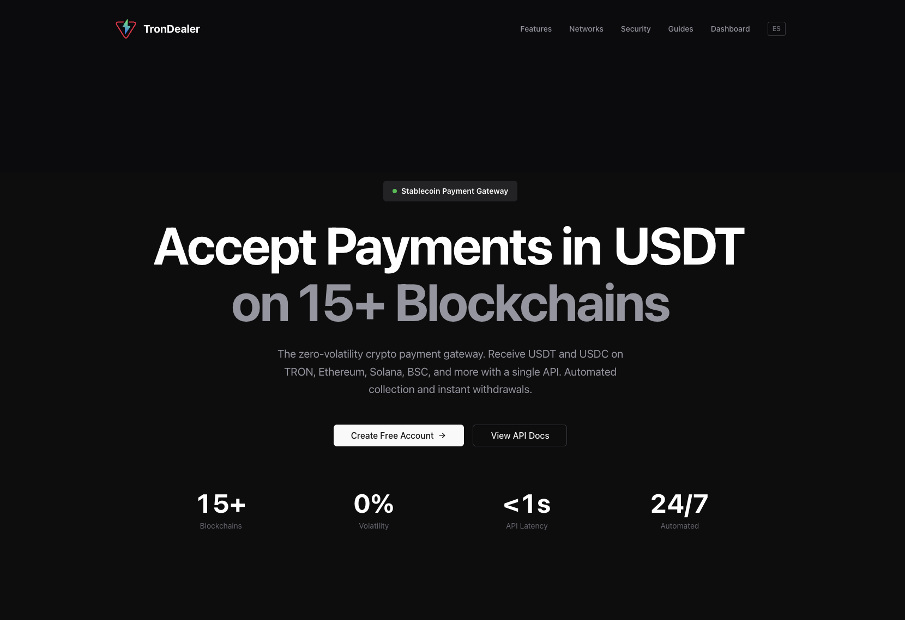

# Trondealer Payments for WooCommerce



Accept **USDT** and **USDC** stablecoin payments in WooCommerce across **9 blockchains** — TRON, Ethereum, BSC, Polygon, Arbitrum, Base, Optimism, Avalanche, and Solana — through the [Trondealer V2 API](https://trondealer.com).

No rate engine, no slippage: stablecoins are charged 1:1 against the order total in USD. No node infrastructure required — Trondealer handles all on-chain interaction.

> **Status:** v0.1.0 — Initial release. Refunds are not yet automated (see [Roadmap](#roadmap)).

---

## Features

- 9 chains supported out of the box, USDT and/or USDC per chain
- Per-order deposit address generation via the Trondealer API
- HMAC-SHA256 signed webhooks for instant order updates
- WP-Cron polling fallback (every 5 minutes) in case a webhook is missed
- Works with both **classic checkout** and **WooCommerce Blocks**
- Underpayment tolerance configurable per-store (default 1%)
- Idempotent settlement: each `(tx_uid, event)` pair is processed at most once
- Built-in connection test that registers your webhook URL automatically
- Optional white-label mode to hide Trondealer branding at checkout

## Requirements

| Component         | Version |
|-------------------|---------|
| WordPress         | ≥ 6.2   |
| PHP               | ≥ 7.4   |
| WooCommerce       | ≥ 7.0   |
| Store currency    | USD     |
| A Trondealer API key | [Sign up free](https://trondealer.com) |

The gateway will hide itself from checkout if the store currency is not USD or no API key is configured.

## Installation

1. Copy this folder into `wp-content/plugins/trondealer-payments/` (or upload the zip from **Plugins → Add New**).
2. Activate **Trondealer Payments** from the WordPress plugins screen.
3. Go to **WooCommerce → Settings → Payments → Trondealer**.
4. Paste your API key and click **Run connection test**. This will:
   - Verify the API key.
   - Generate a webhook secret (`tdp_webhook_secret`) if one does not yet exist.
   - Register your site's webhook URL (`/wp-json/tdp/v1/webhook`) with Trondealer.
   - Send a test ping to confirm end-to-end delivery.
5. Choose which networks/assets to enable and tune the underpayment tolerance.
6. Save.

## Supported networks

| Chain         | Family | Assets       | Typical confirmation |
|---------------|--------|--------------|----------------------|
| TRON          | TRON   | USDT         | ~60s                 |
| Ethereum      | EVM    | USDT, USDC   | ~4m                  |
| BNB Smart Chain | EVM  | USDT, USDC   | ~45s                 |
| Polygon       | EVM    | USDT, USDC   | ~30s                 |
| Arbitrum      | EVM    | USDT, USDC   | ~10s                 |
| Base          | EVM    | USDT, USDC   | ~30s                 |
| Optimism      | EVM    | USDT, USDC   | ~30s                 |
| Avalanche     | EVM    | USDT, USDC   | ~10s                 |
| Solana        | SOL    | USDT, USDC   | ~30s                 |

ETAs are illustrative and surfaced to the customer alongside each option at checkout.

## How it works

1. **Customer picks a chain + asset** at checkout from the configured combos.
2. **The plugin requests a deposit address** from Trondealer, labeled `wc_<order_id>`, and stores it on the order along with the expected amount and asset.
3. **The thank-you page** shows the address, a QR code, the exact amount due, and polls a signed REST endpoint until the order is paid.
4. **Trondealer pushes webhook events** as funds arrive:
   - `transaction.incoming` → order moves to **on-hold**.
   - `transaction.confirmed` → `payment_complete()` is called and the order moves to **processing/completed**.
   - `transaction.swept` → audit-only note added.
5. **A WP-Cron job** runs every 5 minutes as a fallback, replaying any events that were missed (e.g. due to a brief site outage).

### Settlement guards

Each incoming event is checked against the order assignment before it can transition the order:

- **Network mismatch** (e.g. paid on `eth` but expected `bsc`) → order goes to **on-hold** for manual review.
- **Asset mismatch** (e.g. paid USDC where USDT was selected) → **on-hold**.
- **Underpayment** beyond the configured tolerance → **on-hold**.
- **Duplicate event** (same `tx_uid + event`) → ignored.

## Webhook endpoint

```
POST https://<your-site>/wp-json/tdp/v1/webhook
Header: X-Signature-256: sha256=<hex hmac of raw body using tdp_webhook_secret>
```

The plugin verifies the signature with `hash_equals` before parsing. Missing/invalid signature returns 401; missing secret returns 503. The connection test in the admin generates the secret automatically — you do not need to set it by hand.

## Configuration reference

Settings stored under `woocommerce_trondealer_settings`:

| Field              | Description                                                  |
|--------------------|--------------------------------------------------------------|
| `enabled`          | Show the gateway at checkout.                                |
| `title`            | Customer-facing title.                                       |
| `description`      | Customer-facing description.                                 |
| `api_key`          | Trondealer API key (sent as `x-api-key`).                    |
| `api_base`         | Override only for self-hosted Trondealer (defaults to `https://trondealer.com/api/v2`). |
| `enabled_networks` | Multiselect of `network:ASSET` combos.                       |
| `tolerance`        | Underpayment tolerance in percent (0–10).                    |
| `whitelabel`       | Hide Trondealer branding from the customer-facing checkout.  |

Mirrored top-level options used by the webhook/cron paths: `tdp_api_key`, `tdp_api_base`, `tdp_tolerance_pct`, `tdp_webhook_secret`.

## Filters & actions

| Hook               | Type   | Purpose                                              |
|--------------------|--------|------------------------------------------------------|
| `tdp_api_timeout`  | filter | Override the HTTP timeout (seconds) for API calls. Default `15`. |

## Roadmap

- **0.2.0** — Automated crypto refunds (pending the `withdraw` endpoint with `x-api-key` auth in the Trondealer backend). The gateway already advertises refund support so the WooCommerce refund button is exposed; for now it returns a friendly error pointing merchants at the Trondealer dashboard.
- **Future** — EUR support, dynamic networks list via a public `GET /networks` endpoint, additional stablecoins.

## Project layout

```
trondealer-payments.php          Plugin entrypoint, constants, activation hooks.
includes/
  class-tdp-plugin.php           Singleton bootstrap; loads dependencies and wires hooks.
  class-tdp-gateway.php          WC_Payment_Gateway implementation.
  class-tdp-api-client.php       HTTP wrapper for the Trondealer V2 API.
  class-tdp-networks.php         Catalog of chains, assets, families, payment URIs.
  class-tdp-orders.php           Order meta helpers, idempotency keys, amount classification.
  class-tdp-webhook.php          REST endpoints: /webhook and /order-status/{id}.
  class-tdp-cron-fallback.php    5-minute reconcile loop for missed webhooks.
  class-tdp-admin.php            Connection test and settings sync.
  class-tdp-blocks-integration.php  WooCommerce Blocks payment method registration.
  class-tdp-refunds.php          Stub until the V2 withdraw endpoint ships.
templates/
  checkout-payment.php           Thank-you page payment instructions.
  emails/                        Order email partials.
assets/
  css/checkout.css
  js/checkout-blocks.js          Blocks checkout payment method (vanilla JS, no build step).
  js/thankyou-poller.js          Polls /order-status/{id} until paid.
```

See [`CLAUDE.md`](./CLAUDE.md) for an architectural deep-dive.

## License

GPL-2.0-or-later. See the plugin header for the full license URL.

## Links

- [Trondealer](https://trondealer.com) — sign up for an API key
- [Plugin homepage](https://trondealer.com/woocommerce)
